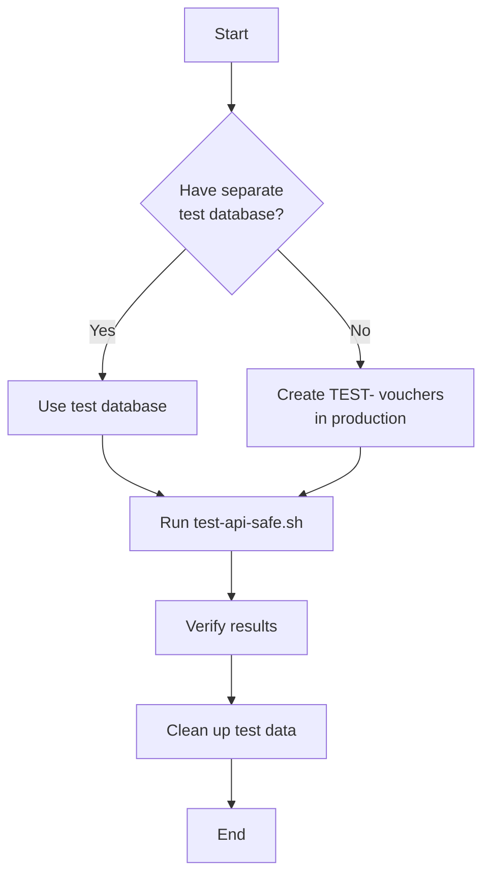

# Testing Safety Guide

## ⚠️ Important: Which Test Script to Use?

We have **two versions** of the test script:

| Script | Safety Level | When to Use |
|--------|--------------|-------------|
| **test-api.sh** | ⚠️ **UNSAFE** | Never use with production or real vouchers! |
| **test-api-safe.sh** | ✅ **SAFE** | Always use this one (recommended) |

---

## 🔴 Why `test-api.sh` is UNSAFE

The original script (`test-api.sh`) does this:

```bash
# Gets ANY available voucher - could be real!
VOUCHERS_RESPONSE=$(curl -s -X GET "$BASE_URL/api/vouchers")
PRODUCT_NAME=$(echo "$VOUCHERS_RESPONSE" | jq -r '.vouchers[0].product_name')

# Creates payment with first available voucher
# ⚠️ This will RESERVE and USE real vouchers if they exist!
```

**What can go wrong:**
- ❌ Reserves real vouchers from production
- ❌ Marks real vouchers as "used"
- ❌ Creates test transactions with real voucher codes
- ❌ Customers can't buy those vouchers anymore
- ❌ You lose inventory

**Example disaster scenario:**
```
You have 5 real "Kopi Kenangan Medium" vouchers in production
→ Run test-api.sh against production
→ Script uses the first available voucher
→ Real voucher is now reserved for test@example.com
→ Real customer can't buy it
→ You lose a sale 💸
```

---

## ✅ Why `test-api-safe.sh` is SAFE

The safe script has multiple protection layers:

### 1. **Only Uses TEST- Vouchers**
```bash
# Filters for TEST- prefix only
TEST_VOUCHERS=$(echo "$VOUCHERS_RESPONSE" | jq '[.vouchers[] | select(.code | startswith("TEST-"))]')

# Checks if any TEST- vouchers exist
if [ "$TEST_COUNT" -eq 0 ]; then
  echo "❌ ERROR: No TEST- vouchers found!"
  exit 1
fi
```

### 2. **Verifies Voucher Code**
```bash
# After creating payment, verifies we got a TEST- voucher
if [[ ! "$VOUCHER_CODE" == TEST-* ]]; then
  echo "🚨 DANGER: Non-test voucher was used!"
  exit 1
fi
```

### 3. **Production Warning**
```bash
# Warns if testing against production URL
if [[ "$BASE_URL" == *"vercel.app"* ]]; then
  echo "⚠️ WARNING: You're testing against production!"
  echo "Are you sure? (yes/no)"
  # Requires manual confirmation
fi
```

### 4. **Test Email Addresses**
```bash
# Uses @example.com emails (easy to identify and clean up)
TEST_EMAIL="test-safe-${TIMESTAMP}@example.com"
```

---

## 📋 How to Use the Safe Script

### Step 1: Create Test Vouchers

**In Supabase SQL Editor:**
```sql
-- Run the test data setup script
-- This creates vouchers with TEST- prefix
INSERT INTO vouchers (id, code, product_name, amount, discounted_amount, used, created_at)
VALUES
  (gen_random_uuid(), 'TEST-KOPI-001', 'Kopi Kenangan Medium', 25000, 20000, FALSE, NOW()),
  (gen_random_uuid(), 'TEST-KOPI-002', 'Kopi Kenangan Medium', 25000, 20000, FALSE, NOW()),
  (gen_random_uuid(), 'TEST-KOPI-003', 'Kopi Kenangan Large', 35000, 30000, FALSE, NOW());
```

Or simply run:
```bash
# Copy contents of test-data-setup.sql into Supabase SQL Editor
```

### Step 2: Run Safe Tests

```bash
# For local testing
./test-api-safe.sh http://localhost:3000

# For production (with confirmation prompt)
./test-api-safe.sh https://flip-callback.vercel.app
```

### Step 3: Verify Results

```sql
-- Check what was used
SELECT code, used FROM vouchers WHERE code LIKE 'TEST-%';

-- Check transactions created
SELECT * FROM transactions WHERE email LIKE 'test-%@example.com';
```

### Step 4: Clean Up

```sql
-- Delete test transactions
DELETE FROM transactions WHERE email LIKE 'test-%@example.com';

-- Reset test vouchers
UPDATE vouchers SET used = FALSE WHERE code LIKE 'TEST-%';

-- Or delete test vouchers entirely
DELETE FROM vouchers WHERE code LIKE 'TEST-%';
```

---

## 🛡️ Safety Comparison

### Scenario: Testing Against Production

**With `test-api.sh` (UNSAFE):**
```
Real voucher inventory before: 10 vouchers
↓
Run test-api.sh
↓
Real voucher inventory after: 9 vouchers (1 reserved for test)
↓
❌ Lost 1 voucher, customer can't buy it
```

**With `test-api-safe.sh` (SAFE):**
```
Real voucher inventory before: 10 vouchers
Test voucher inventory before: 5 TEST- vouchers
↓
Run test-api-safe.sh
↓
Real voucher inventory after: 10 vouchers (unchanged) ✅
Test voucher inventory after: 4 TEST- vouchers (1 used for test)
↓
✅ No impact on real vouchers
```

---

## 🔍 How to Identify Test Data

All test data has these characteristics:

| Type | Identifier |
|------|------------|
| **Vouchers** | Code starts with `TEST-` |
| **Emails** | Contains `@example.com` or starts with `test-` |
| **Transactions** | Uses test email addresses |

**SQL to find all test data:**
```sql
-- Test vouchers
SELECT * FROM vouchers WHERE code LIKE 'TEST-%';

-- Test transactions
SELECT * FROM transactions
WHERE email LIKE '%@example.com'
   OR email LIKE 'test%@%';
```

---

## 🚨 Emergency: I Ran the Unsafe Script!

If you accidentally ran `test-api.sh` against production:

### Step 1: Find Affected Vouchers
```sql
-- Find transactions created by test
SELECT transaction_id, voucher_code, status, created_at
FROM transactions
WHERE email LIKE '%@example.com'
  AND created_at > NOW() - INTERVAL '1 hour'  -- Recent transactions
ORDER BY created_at DESC;
```

### Step 2: Cancel Test Transactions
```sql
-- For each test transaction, call cancel function
SELECT cancel_transaction('TRANSACTION-ID-HERE');

-- This will:
-- 1. Mark transaction as CANCELLED
-- 2. Release voucher back to pool (used = FALSE)
```

### Step 3: Verify Vouchers Released
```sql
-- Check if vouchers are back in pool
SELECT code, used FROM vouchers
WHERE code IN (
  SELECT voucher_code FROM transactions
  WHERE email LIKE '%@example.com'
);
-- All should show: used = FALSE
```

### Step 4: Clean Up Test Data
```sql
-- Delete test transactions
DELETE FROM transactions WHERE email LIKE '%@example.com';
```

---

## ✅ Best Practices

1. **Always use `test-api-safe.sh`** instead of `test-api.sh`
2. **Set up test data first** with `test-data-setup.sql`
3. **Use separate environments:**
   - Development database for testing
   - Production database for real customers only
4. **Never test against production** unless absolutely necessary
5. **Clean up test data** regularly to avoid clutter
6. **Use TEST- prefix** for all test vouchers
7. **Use @example.com** for all test emails

---

## 📊 Checklist Before Testing

Before running any test script, verify:

- [ ] I have created TEST- vouchers in the database
- [ ] I'm using `test-api-safe.sh` (not the unsafe version)
- [ ] I'm testing against the correct environment
- [ ] I understand what the script will do
- [ ] I have a way to clean up test data afterward
- [ ] If testing production, I have confirmed this is necessary

---

## 🎯 Recommended Testing Workflow



**Ideal setup:**
1. Local development: Use `test-api-safe.sh` with test vouchers
2. Staging environment: Use `test-api-safe.sh` with test vouchers
3. Production: **DON'T TEST** - or use test vouchers with extreme caution

---

## 📞 Summary

| Question | Answer |
|----------|--------|
| Will the script impact real vouchers? | `test-api.sh`: **YES** ❌<br/>`test-api-safe.sh`: **NO** ✅ |
| Which script should I use? | **Always use `test-api-safe.sh`** |
| Do I need test vouchers? | **Yes**, create them with `test-data-setup.sql` |
| Can I test against production? | **Not recommended**, but if you must, use `test-api-safe.sh` with TEST- vouchers |
| How do I clean up? | `DELETE FROM transactions WHERE email LIKE 'test-%@example.com'` |

---

**Remember:** When in doubt, use `test-api-safe.sh` - it has multiple safety checks to protect your real vouchers! 🛡️
